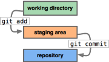
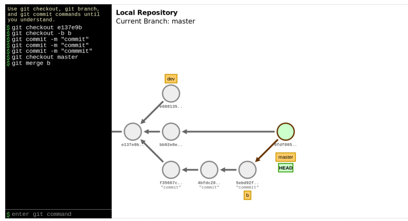

#create repository
.left-column[
## create repo

]

.right-column[
```bash
mkdir Lab && cd Lab
git init
Initialized empty Git repository in /home/admin/Lab/.git/
ls
...  .git

git config --global user.name 'sawangpong muadphet'
git config --global user.email 'sawangpong@itbakery.net'

touch file1.txt
git add .

git status

git commit -m "first commit"
git log -b
```
]

.footnote[Git Explain[d3 visualize](https://onlywei.github.io/explain-git-with-d3/)]

---

# Git flow
#### - git add การเปลี่ยนแปลง ไปยัง index เตรียมพร้อมสำหรับการ commit 

.left-column[
## create file 
### - untracked file
]

.right-column[
```bash
$ touch file2.txt
$ git status
On branch master
Untracked files:
  (use "git add <file>..." to include in what will be committed)

    file2.txt

nothing added to commit but untracked files present (use "git add" to track)

$ git add file2.txt 
$ git status
On branch master
Changes to be committed:
  (use "git reset HEAD <file>..." to unstage)

    new file:   file2.txt

```
]

---

# Git create branch
### - create branch for development

```bash
git checkout -b dev
git chechout master
git merge dev
```
---

# Git merge



---

# git commit 3 time

```bash
touch file1.txt
echo "commit1" >> file1.txt
git add .
git commit -m "commit1"
echo "commit2" >> file1.txt 
git add .
git commit -m "commit2"
echo "commit3" >> file1.txt 
git add. 
git add .
git commit -m "commit3"

```
---

# git reset HEAD^

```bash
git reset HEAD^
git reset HEAD^
git log
git reflog

2c55fe9 HEAD@{0}: checkout: moving from master to 2c55fe
2c55fe9 HEAD@{1}: reset: moving to HEAD^
567a130 HEAD@{2}: reset: moving to HEAD^
66a9c69 HEAD@{3}: commit: commit3
567a130 HEAD@{4}: commit: commit2
2c55fe9 HEAD@{5}: commit (initial): commit1

```
---

# bring master back

```bash
git checkout 2c55fe
git merge master

```
